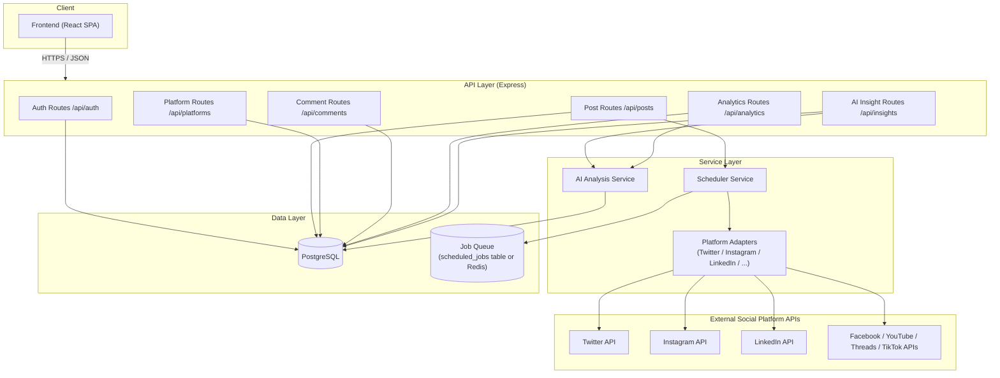

# OmniPost — Backend Architecture Design

> **Status: Design stage.** Describes the backend the `/backend` skeleton folder is structured after. Nothing here is deployed or connected to the frontend — see `backend/README.md` for what the skeleton does and doesn't do.

## 1. High-Level Architecture



## 2. Layering Rationale

- **API layer** — thin route + controller pairs, one resource group per concern (auth, posts, platforms, comments, analytics, AI insights). Owns request validation and HTTP concerns only; no business logic.
- **Service layer** — where the actual logic would live:
  - **Scheduler Service** polls `scheduled_jobs` (or a Redis-backed queue in a real deployment) and triggers publishing through the right platform adapter when `run_at` is reached.
  - **Platform Adapters** — one per social network, all implementing the same interface (`publishPost`, `fetchComments`, `fetchEngagement`). This isolates the quirks of each platform's real API behind a common contract, so the rest of the system doesn't care which platform it's talking to.
  - **AI Analysis Service** — consumes `analytics_snapshots` + `post_platforms` data and writes rows into `ai_insights`. Kept as its own service (not baked into the analytics controller) since it's explicitly a "planned" feature, and isolating it means it can be built, swapped, or backed by an external AI provider later without touching the rest of the API.
- **Data layer** — PostgreSQL per `docs/schema.sql`, plus a queue for scheduled jobs (could be the same DB initially, Redis/BullMQ if it needed to scale).
- **External APIs** — the real Twitter/Instagram/LinkedIn/etc. APIs, only ever touched through the adapter layer.

## 3. API Surface (Design)

| Method | Route | Purpose |
|---|---|---|
| POST | `/api/auth/register` | Create a user account |
| POST | `/api/auth/login` | Authenticate, issue a session/JWT |
| GET | `/api/users/me` | Current user's profile |
| PATCH | `/api/users/me` | Update profile/bio/website |
| GET | `/api/platforms` | List supported platforms |
| GET | `/api/platforms/connections` | List the current user's connected accounts |
| POST | `/api/platforms/connections` | Start a connect/OAuth flow for a platform |
| DELETE | `/api/platforms/connections/:id` | Disconnect a platform |
| GET | `/api/posts` | List the user's posts (draft/scheduled/published) |
| POST | `/api/posts` | Create a post (draft, scheduled, or publish-now) |
| GET | `/api/posts/:id` | Get one post with its per-platform status |
| PATCH | `/api/posts/:id` | Edit a draft/scheduled post |
| DELETE | `/api/posts/:id` | Delete a post |
| GET | `/api/comments` | Unified comment feed, filterable by platform/search |
| POST | `/api/comments/:id/replies` | Reply to a comment |
| GET | `/api/analytics/overview` | Aggregate analytics for the dashboard |
| GET | `/api/analytics/posts/:id` | Per-post analytics time series |
| GET | `/api/insights` | List AI-generated insights for the user |

## 4. Auth Model (Design)

JWT-based session auth: `POST /api/auth/login` issues a signed JWT, sent on subsequent requests as `Authorization: Bearer <token>`. A small `auth.middleware` validates the token and attaches `req.user` before it reaches a controller. Platform connections (Twitter/Instagram/etc.) are a separate OAuth2 flow per platform, stored in `platform_connections`, and are not the same thing as the user's OmniPost login.

## 5. How the Skeleton Maps to This

```
backend/src/
├── routes/        → "API layer" boxes above, one file per resource
├── controllers/    → glue between routes and services/models
├── services/       → Scheduler Service, AI Analysis Service, Platform Adapters
├── models/         → one file per table in docs/schema.sql
├── middleware/      → auth middleware
└── config/          → db connection config (stubbed, not connected)
```

Every file in `/backend` contains real function signatures and comments describing intended behavior, but functions either return mock data or throw a "not implemented" error — consistent with the frontend, where buttons exist but don't perform real actions. The goal is a structurally accurate blueprint a future implementer (or a teammate) could pick up and fill in.

## 6. Deliberate Simplifications (Prototype Scope)

- No API gateway, rate limiting, or caching layer designed yet — would matter at scale, not for a prototype.
- Only 3 platform adapters are stubbed in detail (Twitter, Instagram, LinkedIn); the remaining 4 (Facebook, YouTube, Threads, TikTok) follow the same adapter interface and are noted but not individually stubbed.
- The AI Analysis Service is a stub interface only — no model, prompt, or provider has been chosen. That decision is explicitly left as future work.
