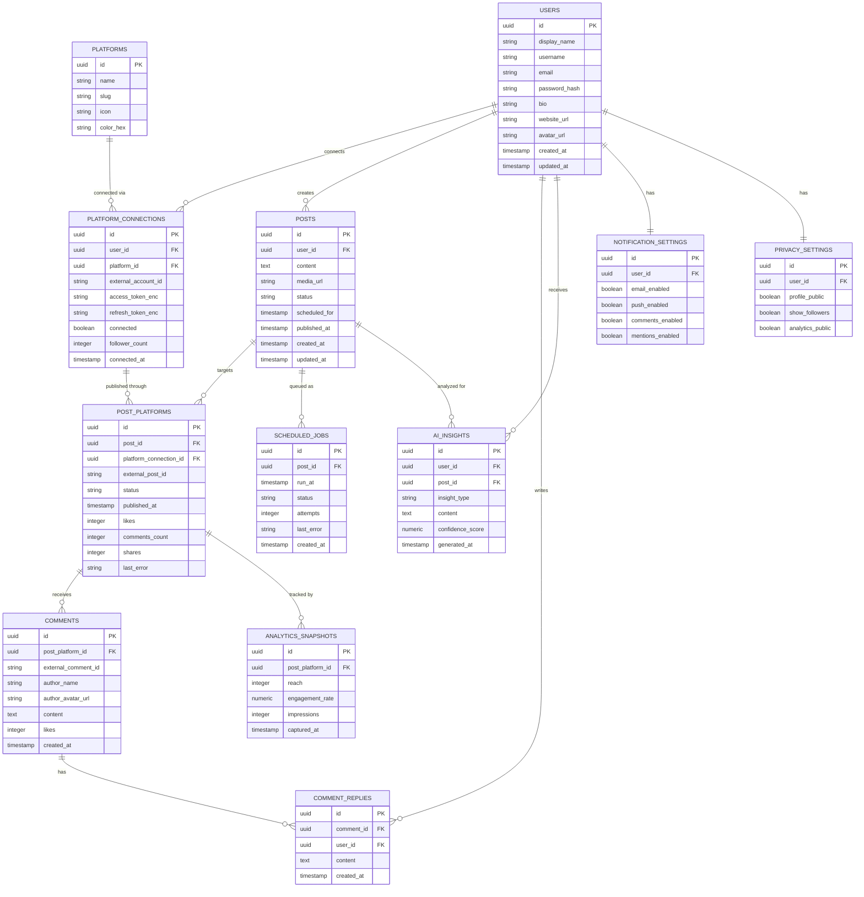

# OmniPost — Database Schema Design

> **Status: Design stage.** This schema is part of the prototype's backend/database design work. It is not deployed anywhere, and the frontend does not read from or write to a real database — it still runs entirely on the mock data in `src/data/mockData.ts`. This document, and the matching `schema.sql`, are the design artifacts produced during the prototype phase.

## 1. Design Goals

- Support multiple connected social platforms per user (Twitter/X, Instagram, Facebook, YouTube, LinkedIn, Threads, TikTok).
- Support a single post being published to several platforms, each with its own publish status and engagement numbers (mirrors the `platforms: string[]` field on a post in the current frontend mock data).
- Support a unified comment feed across platforms.
- Support scheduling a post for future publishing (a queue/job, not just a timestamp on the post).
- Leave room for the **planned AI-driven post-performance analysis** feature without forcing it into the core post/analytics tables.
- Support the notification and privacy toggles already present in the Settings page.

## 2. Entity-Relationship Diagram

## 3. Table-by-Table Notes

### `users`
The account owner. One `users` row per OmniPost account (not per connected social platform). Maps to the "Profile Settings" section of the Settings page.

### `platforms`
A small reference/lookup table — one row per supported network (Twitter/X, Instagram, Facebook, YouTube, LinkedIn, Threads, TikTok). Mirrors `socialPlatforms` in `mockData.ts`, but without `connected` or `followers`, since those are per-user facts, not per-platform facts — they live on `platform_connections` instead.

### `platform_connections`
A user's connection to one specific platform (their Twitter account, their Instagram account, etc.). Holds the OAuth tokens (encrypted at rest — `*_enc` columns), whether it's currently connected, and follower count. This is what powers the "Connected Platforms" list in the Sidebar and Settings page.

### `posts`
One row per post a user composes, independent of which platforms it goes to. `status` is `draft | scheduled | published`. This matches the `Post` interface already in `mockData.ts`, minus the platform list and per-post engagement numbers, which move to `post_platforms` below — because in reality engagement is per-platform, not a single number per post (a post can do well on LinkedIn and poorly on Twitter).

### `post_platforms`
Join table between a `post` and the `platform_connection` it was (or will be) published through. Carries the platform-specific publish status, the platform's own post ID once published, and the per-platform engagement counts (likes/comments/shares) shown in the Dashboard and Analytics pages.

### `comments`
A comment on a specific `post_platform` row (i.e., a comment on the Twitter copy of a post, not the post in the abstract). Matches the unified Comments feed.

### `comment_replies`
A reply sent by the OmniPost user to an external comment — supports the "Quick Reply Templates" and Reply button in `CommentsView.tsx`.

### `analytics_snapshots`
Time-series engagement data per `post_platform`, captured periodically. This is what the Analytics page's "Engagement Over Time" chart would actually be backed by, instead of the current static CSS bars.

### `scheduled_jobs`
A queue entry for a post that needs to be published later. Kept separate from `posts.scheduled_for` so retries, failures, and job status can be tracked without overloading the `posts` table — this is what a background worker (see architecture doc) would poll.

### `ai_insights`
Deliberately generic (`insight_type` + free-text `content` + `confidence_score`) so it can hold things like "best time to post," "best content type," or "platform recommendation" without needing a new table per insight type. `post_id` is nullable because some insights (e.g., "best time to post") are account-level, not tied to one post.

### `notification_settings` / `privacy_settings`
One-to-one with `users`, directly backing the toggle switches already built in `Settings.tsx`.

## 4. Deliberate Simplifications (Prototype Scope)

- No multi-tenant/team-account model — one `users` row per person, no organizations. Would be a natural next step if "team collaboration features" (already listed as future work) were built out.
- No media table — a single `media_url` on `posts` is a placeholder for what would really be a `media_assets` table supporting multiple images/video per post.
- Token encryption is named (`access_token_enc`) but not designed in detail — real implementation would need a KMS/secrets approach, intentionally out of scope here.
